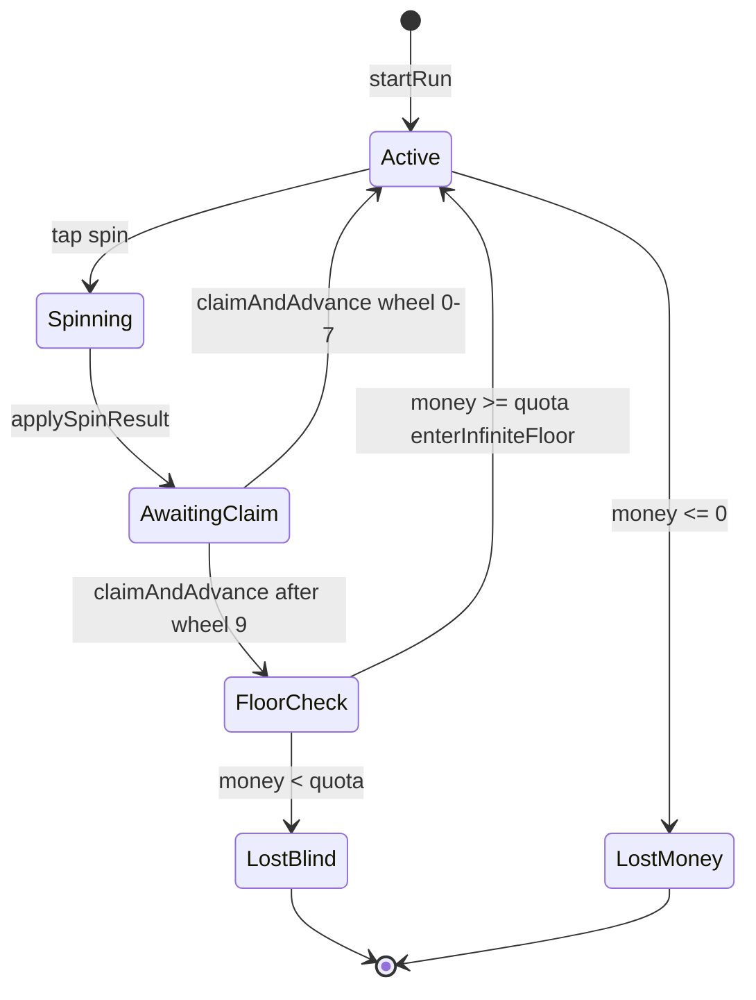

# SpinWheel — Game Design Document

**Read this first if you are new to the project.**

This document explains what the player does, how a run works, and where to change content in code. It is written for **you (designer)** first and for **AI tools** second (see [Appendix: reverse prompt](#appendix-reverse-prompt-for-ai)).

---

## In 60 seconds

1. You start a **run** with **$500** and a wheel that has **6 wedges** (grows to 7, then 8 max).
2. Each **floor** has **9 wheels** in a fixed order. You **spin once** per wheel.
3. The wedge you land on gives **cash**, a **perk**, a **chip**, a **curse**, etc.
4. After each spin you **swipe up** (or tap Next) to go to the next wheel.
5. After wheel 9, the game checks: is your **bank ≥ floor target**?
   - **Yes** → you cleared the floor → harder **floor 2**, same 9-wheel pattern.
   - **No** → you lose the run.
6. If your bank hits **$0** at any time → you lose immediately.
7. **Shop** is optional — open it yourself from the top bar; it does not pop up after every wheel.
8. **Perks** = small icons in your loadout (passive bonuses for the whole run).
9. **Chips** = another row of icons (also passives). They are **not** spell cards.

**Pacing goal:** about **10 minutes** per average run (~9 wheels × ~45 seconds × ~1.5 floors).

---

## Glossary (use these names)

| Term | Meaning |
|------|---------|
| **Bank / money** | Your cash. This is the only number that decides win/lose on a floor. |
| **Floor** | One full pass through all 9 wheels, then a target check. |
| **Floor target** (quota) | Minimum bank required after wheel 9. Shown in the UI progress bar. |
| **Wheel** | One spin stage (wedges on the disc). Exactly one spin per wheel per floor. |
| **Wedge / slice** | One segment on the wheel; each has a prize type and effect. |
| **Perk** | Permanent upgrade for this run (icon in loadout). Bought in shop or won on wheel. |
| **Chip** | Passive modifier (icon in chip row). Code calls it `deck` / `card` — ignore “card” as fantasy. |
| **Shield** | Blocks **one** cash loss (flat $, % of bank, or wipe). |
| **Shop** | Branching perk store; manual open only. |
| **Claim / Next** | After a spin, confirm the result and move to the next wheel (swipe or hub). |

---

## What the player sees (one floor)

```
Floor starts — bank $500, target e.g. $520, wheel 1 of 9
        │
        ▼
   ┌─────────┐
   │  SPIN   │  Tap the wheel hub
   └────┬────┘
        │  Wheel animates, lands on a wedge
        ▼
   ┌─────────┐
   │ RESULT  │  Flash: +$100, new perk, curse, etc.
   └────┬────┘
        │  Hub shows "Next" — swipe up or tap
        ▼
   Next wheel (2 of 9) … repeat …
        │
        ▼
   After wheel 9
        │
        ├── Bank ≥ floor target?  →  Floor cleared  →  Next floor (harder)
        └── Bank < floor target?  →  Run lost
```

**Important:** You never spin the same wheel twice on one floor. Miss the target after wheel 9 and the run ends (unless you still have $0 bankruptcy rules).

---

## Win and lose (simple rules)

| What happens | When |
|--------------|------|
| **Lose — bankrupt** | Bank reaches **$0** (any time). |
| **Lose — missed target** | Finished wheel 9 and bank **below floor target**. |
| **Win floor** | Finished wheel 9 and bank **at or above floor target**. |
| **Keep playing** | After winning a floor, start floor 2+ with harder odds and a higher target. |

There is no “final credits” screen goal yet — the mode is **infinite floors** until you lose.

---

## The 9 wheels (every floor, same order)

Each floor uses the same **roles** in the same order. Names in the UI may show `· F2` on later floors but the **design role** is unchanged.

| # | What you see | Design purpose |
|---|----------------|----------------|
| 1 | **Starter** | Gentle start: small cash, intro perks |
| 2 | **Cash Rush** | More money wedges |
| 3 | **High Roller** | Big wins and bigger losses, curses |
| 4 | **Cool Down** | Recovery: shields, +1 wedge, safer slices |
| 5 | **Stakes Wheel** | Can lose **% of your whole bank** (danger is on the wedges, not a separate banner) |
| 6 | **Jackpot** | Rare huge cash and relics |
| 7 | **Power Surge** | Many **perk** wedges |
| 8 | **Mod Wheel** | Add, remove, or upgrade **chips** |
| 9 | **Boss Wheel** | Worst risks (wipe, −75% bank) and best rewards |

**Difficulty within a floor:** Later wheels (5–9) are meant to feel heavier. Higher **floor number** makes negatives stronger and cash prizes scale up.

**Where to edit order or pools:** `src/game/loop.ts` (`WHEEL_ROTATION`) + `src/game/prizes.ts` (`SLICE_POOLS`).

---

## What can land on a wedge (prize types)

These are the **slice kinds** in data. Player sees a label + icon on the wheel.

| On wheel | What it does |
|----------|----------------|
| **+$ cash** | Adds money (perk multipliers can boost this). |
| **−$ cash** | Removes money; **shield** blocks one hit. |
| **−% bank** | Loses a percent of current bank (Stakes / Boss). |
| **Lose all** | Wipes bank unless shield blocks. |
| **Perk** | Adds a run perk (if not owned). |
| **Curse / debuff** | Sticks for the run; hurts economy or odds. |
| **Relic** | Passive rule changer (weights, money mult). |
| **+ chip** | Adds a chip to your row (max 12). |
| **Burn chip** | Removes your last chip. |
| **Upgrade chip** | Upgrades chip tier (copper → die → wide). |
| **Pass / neutral** | No effect — breathing room. |

Full pool contents (every wedge ID and weight): `src/game/prizes.ts`.

---

## Perks (run upgrades)

Icons in the **perk row**; tap for description. Won on wheels or bought in **shop**.

| Perk | Tier | What it does (today) |
|------|------|----------------------|
| Lucky Streak | 0 | Better odds on cash & perk wedges |
| Iron Reserve | 0 | +1 shield when acquired |
| Quota Shield | 0 | Floor target −12% |
| +1 Slice | 0 | One more wedge on the **next** wheel (6→7→8 cap) |
| High Roller | 1 | +15% cash from money wedges |
| Gold Rush | 1 | +25% cash from money wedges |
| Safe Harbor | 1 | +1 shield |
| Coupon King | 2 | Shop prices −15% |
| Hot Table | 2 | +10% rare / jackpot odds |
| VIP Roller | 2 | +20% cash from money wedges |
| Double Down | 2 | Next cash wedge ×2, then used up |
| Compounder | 3 | +5% cash per floor already cleared |

**+1 Slice rule (easy to get wrong):** The wheel does **not** gain a wedge in the middle of a spin. Capacity increases are **queued** and the layout updates when you **go to the next wheel** (swipe / claim). Max **8** wedges.

**Edit perks:** `src/data/perks.ts` (names/text) + `src/systems/PerkSystem.ts` / `ProbabilityResolver.ts` (logic).

---

## Shop

- Opened **manually** (store icon) — **not** after every wheel.
- **Branching tree:** cheap perks first; later nodes need earlier buys.
- Pay from your **bank**; same perks as on wheels (including +1 Slice twice until 8 wedges).
- **Edit tree & prices:** `SHOP_PERK_TREE` in `src/game/loop.ts`.

---

## Chips (the second loadout row)

**Not spell cards** — small passives, casino-themed.

| Chip | Effect |
|------|--------|
| Copper Chip | +$25 at run start |
| Loaded Die | Positive wedges slightly more likely |
| Vault Token | +1 shield at run start |
| Wide Table | Start with 8 wedges (if capacity allows) |

Max **12** chips. **Edit:** `src/data/cards.ts`.

---

## Curses and relics (shorter lists)

**Curses (debuffs):** Debt Mark, Rusted Gear, Curse of Greed — tax money or worsen bad odds.  
**Relics:** Lucky Coin, Void Lens, Boss Slayer — passive weight / money tweaks.

**Edit:** `src/data/debuffs.ts`, `src/data/relics.ts`.

---

## Floor target (how much you need after wheel 9)

**Floor 1 example:** target is roughly **$320 + floor scaling** (exact formula in code).

- Formula: `320 + floor×200 + (floor−1)^1.35×90`
- **Quota Shield** perk: multiply target by **0.88**

The UI bar compares **current bank** vs **target**.  
**Edit formula:** `src/game/gdd.ts` → `getBlindQuota()`.

---

## Harder floors (infinite mode)

After you clear a floor:

- Floor number goes up.
- Bad wedges get relatively more likely.
- Stakes wheels hit harder.
- Money wedge values inflate slightly.
- Floor target increases.

**Edit scaling knobs:** `INFINITE_SCALING` in `src/game/loop.ts`.

**Floor names in UI:** Warm-Up → Main → Turbo → Boss → Overdrive → then `Floor N`.

---

## Controls & screens (player UX)

| Player action | Result |
|---------------|--------|
| Tap **Spin** on hub | One spin on current wheel |
| **Swipe up** or tap **Next** | Apply result and move to next wheel |
| Tap **shop** icon | Open perk shop |
| Tap **perk / chip** icon | Detail popup |
| Swipe between wheels | Only **after** winning wedge (claim state) |

Technical reel behavior (buffers, animation) lives in code; players only need “swipe to next wheel after a win.”

**UI feedback (no layout pop-ins):** Results show in the **bottom prize bar** (`RunPrizeFlash`) and new perks **highlight in the loadout row**. There is no floating “perk unlocked” toast and no stakes-wheel warning banner (those caused layout jumps).

---

## Game loop in detail (step by step)

This is the full path from tap to next wheel — use it when debugging or extending features.

### Phase A — Before spin

| Step | What happens | Where |
|------|----------------|-------|
| 1 | Run is `phase: active`, `wheelIndex` = current wheel (0–8). | `run.schema.ts` |
| 2 | UI shows “Tap to spin” in prize bar. Hub mode = `spin`. | `RunPrizeFlash`, `RunWheelFeed` |
| 3 | Player taps hub → `handleExternalSpinPress`. | `RunWheelFeed.tsx` |
| 4 | Game checks `RunManager.canSpin` (active, correct index, money > 0). | `RunManager.ts` |
| 5 | **Outcome is chosen now** (not when animation ends): `resolveSlice` + modifiers. | `ProbabilityResolver.ts`, `useWheelModifiers.ts` |
| 6 | `setSpinning(true)`, wheel animates to that index. | `runStore`, `SpinWheel` |

### Phase B — Spin ends

| Step | What happens | Where |
|------|----------------|-------|
| 7 | `onSpinComplete` → `applySpinResult(wheelIndex, sliceId)`. | `runStore.ts` |
| 8 | `RunManager.applySliceResult` applies payload (money, perk, chip, …). | `RunManager.ts` → `PerkSystem`, `DeckSystem`, etc. |
| 9 | If bankrupt → `phase: lost_money`. If still active → `awaitingClaim: true`. | `RunManager.checkRunEnd` |
| 10 | UI stores `lastEffect` (icon + labels for prize bar). New perk → `lastWonPerkId` for loadout highlight. | `runStore` ui slice |
| 11 | Prize bar shows result + “swipe up”; hub = `claim`. | `RunPrizeFlash`, hub in `SpinWheelStage` |

### Phase C — Claim / next wheel

| Step | What happens | Where |
|------|----------------|-------|
| 12 | Swipe up or hub Next → reel spring OR `requestAdvance`. | `useReelStripEngine.ts` |
| 13 | On commit: `commitWheelLayout()` if `pendingWheelRebuild` (+1 slice). | `runStore`, `PerkSystem` |
| 14 | `claimAndAdvance()` → `RunManager.advanceWheel`. | `runStore.ts` |
| 15 | `wheelIndex++`. If index was 8 → `checkBlindClear` (quota vs money). | `RunManager.ts` |
| 16 | Reel index resets; next wheel ready to spin. Shop does **not** open. | `RUN_LOOP.shopOpensBetweenWheels` |

### Phase D — Floor end

| Step | What happens | Where |
|------|----------------|-------|
| 17 | `money >= blindQuota` → `phase: won` → modal → continue → `enterInfiniteFloor`. | `RunManager`, `RunEndModal` |
| 18 | New floor: `floor++`, rebuild wheels, higher scaling + quota. | `InfiniteScaling.ts`, `WheelSystem.buildFloorWheels` |



---

## Data architecture — where everything lives

Think in **layers**. Content flows **down** into a **run**, UI reads **up** from the store.

```
┌─────────────────────────────────────────────────────────────┐
│  DESIGN DATA (you edit)                                      │
│  loop.ts          → 9 wheels, shop tree, defaults, scaling   │
│  prizes.ts        → slice pools (wedges + weights + payload) │
│  data/perks.ts    → perk names, tiers, descriptions          │
│  data/cards.ts    → chip definitions + effects               │
│  data/debuffs.ts, relics.ts                                  │
│  iconRegistry.ts  → all icons (overrides catalogs)           │
│  gdd.ts           → quota formula, pacing constants          │
└──────────────────────────┬──────────────────────────────────┘
                           │ build / sync
                           ▼
┌─────────────────────────────────────────────────────────────┐
│  RUNTIME (per play session)                                  │
│  RunState: money, floor, wheelIndex, perks[], deck[],        │
│            wheels[] (built slices per wheel), blindQuota,    │
│            sliceCapacity, pendingWheelRebuild, phase         │
└──────────────────────────┬──────────────────────────────────┘
                           │ Zustand
                           ▼
┌─────────────────────────────────────────────────────────────┐
│  UI                                                          │
│  RunScreen → bar, stage rail, loadout, wheel feed, prize bar │
└─────────────────────────────────────────────────────────────┘
```

### File roles (what to open)

| File | Role |
|------|------|
| `src/game/loop.ts` | **Spine:** wheel order, shop tree, `RUN_DEFAULTS`, `WHEEL_STAGES` colors |
| `src/game/prizes.ts` | **Content:** every wedge in every pool (`SLICE_POOLS`) |
| `src/data/perks.ts` | Perk catalog (logic in `PerkSystem.ts`) |
| `src/data/cards.ts` | Chip catalog (logic in `DeckSystem.ts`) |
| `src/systems/WheelSystem.ts` | Builds `run.wheels[]` from pipeline + capacity |
| `src/systems/RunManager.ts` | Spin rules, apply slice, advance, floor win/lose |
| `src/stores/runStore.ts` | Bridge: spin/claim actions + UI flags |
| `src/schemas/*.ts` | Type shapes — contract between systems and UI |
| `src/game/ContentRegistry.ts` | `GameContent.*` API + validation + snapshot |

### How a wedge gets onto the wheel

1. `WHEEL_ROTATION[i].slicePoolId` picks a pool (e.g. `"risk"`).
2. `SLICE_POOLS.risk` is an array of `SliceDefinition`.
3. `WheelSystem.buildFloorWheels` copies slices into each wheel, applies floor scaling weights.
4. `sliceCapacity` (6–8) determines how many wedges are placed on the disc (remap on advance if pending).
5. UI reads `wheel.spinItems` for labels/icons on the disc.

### How a spin picks a wedge

1. `buildResolveContext(run, wheel)` merges perks, debuffs, relics, chips, wheel modifiers, floor scaling.
2. Each slice gets an **effective weight** (`ProbabilityResolver`).
3. Weighted random → `index` → animation lands there.
4. `applySliceResult` reads that slice’s `kind` + `payload`.

**To make a wedge more common:** raise `baseWeight` or add tag `positive` / `rare` and tune context mults in `useWheelModifiers.ts`.

---

## Run state — fields that matter

| Field | Meaning |
|-------|---------|
| `money` | Bank |
| `floor` | Current floor number |
| `wheelIndex` | 0–8, current wheel in floor |
| `perks` | Owned perk ids |
| `deck` | Owned chip ids (max 12) |
| `shields` | Remaining loss blocks |
| `debuffs` | Active curse ids |
| `relics` | Relic ids |
| `sliceCapacity` | 6, 7, or 8 wedges |
| `pendingWheelRebuild` | true = layout updates on next claim, not mid-spin |
| `blindQuota` | Floor target $ |
| `wheels` | Built wheel instances for this floor |
| `phase` | `active` \| `won` \| `lost_money` \| `lost_blind` |
| `history` | Log of spins (wheelIndex, sliceId) |

Persisted via `saveRunCheckpoint` in MMKV when state changes.

---

## How to improve and advance the game (design playbook)

Work in this order so changes stay coherent.

### 1. Tune the economy (fastest impact)

| Goal | Touch |
|------|--------|
| Runs too short / too hard | `getBlindQuota()` in `gdd.ts`, starting money in `RUN_DEFAULTS` |
| Payouts feel weak | Money `payload.moneyDelta` in `prizes.ts` pools `base`, `yield`, `jackpot` |
| Too many bankruptcies | Fewer `money_loss` / `bank_cut` weights in `risk`, `mini_boss`, `boss` pools |
| Runs too easy | Raise quota, add negative weight in `INFINITE_SCALING` |

### 2. Shape a floor’s drama

| Goal | Touch |
|------|--------|
| Wheel 5–9 feel deadlier | Weights in `mini_boss`, `boss` pools; `stakesBoost` on wheel defs in `loop.ts` |
| More perk runs | `power` pool + shop tier 1–2 perks |
| More build variety | `deck` pool + new chips in `cards.ts` + `deck_add` slices |

### 3. Add a new perk

1. Add entry in `src/data/perks.ts` (id, name, description, tier).
2. Add icon in `iconRegistry.ts` → `perk`.
3. Implement effect in `PerkSystem.ts` and/or `ProbabilityResolver.ts` / `useWheelModifiers.ts`.
4. Add to shop: `SHOP_PERK_TREE` in `loop.ts`.
5. Optional: add wedge in a pool with `payload: { perkId: "your_id" }`.

### 4. Add a new wedge type to a wheel

1. Pick pool in `prizes.ts` (or create new pool id).
2. Add `SliceDefinition` with `kind`, `label`, `baseWeight`, `payload`.
3. Point a wheel at that pool in `WHEEL_ROTATION` if new pool.

### 5. Add a new chip

1. `cards.ts` + effect handlers in `DeckSystem.ts` (`getDeckModifiers`, `applyCardEffectsOnRunStart`).
2. Icon in `iconRegistry.ts` → `card`.
3. `deck_add` slice with `payload: { cardId }` in a pool.

### 6. Change wheel order or count

Edit `WHEEL_ROTATION` in `loop.ts` — keep `WHEEL_COUNT` in sync. Update GDD table and stage rail if player-facing order changes.

### 7. UI / feel

| Goal | Touch |
|------|--------|
| Icons | `iconRegistry.ts` only |
| Pacing text | `RunPrizeFlash`, slice `label` in prizes |
| Swipe feel | `features/cash-spin/reelStripConstants.ts` |
| No layout shift | Fixed-height chrome in `lib/layout/runLayout.ts`; avoid conditional banners |

### 8. Validate before shipping a content pass

- Run `GameContent.validate()` (design screen shows OK badge).
- Play floor 1: can you reach quota with average play?
- Play to floor 3: does difficulty curve feel fair?
- Win +1 slice perk: wedges increase only **after** swipe to next wheel.

---

## How to change icons (one file)

**File:** `src/game/content/iconRegistry.ts`

Change the `icon` string (Material icon name) under `perk`, `card`, `debuff`, `relic`, or optional `slice` / `sliceKind`.

Example — change Lucky Streak everywhere:

```ts
lucky_streak: { icon: "casino", iconFamily: "MaterialIcons" },
```

Wheel wedges that award a perk **inherit that perk’s icon** unless you override the slice id in `slice: { ... }`.

---

## Where to edit what (cheat sheet)

| I want to change… | Open this file |
|-------------------|----------------|
| Icons | `src/game/content/iconRegistry.ts` |
| Perk names / descriptions | `src/data/perks.ts` |
| Perk power | `src/systems/PerkSystem.ts`, `ProbabilityResolver.ts` |
| Wheel order or which pool a wheel uses | `src/game/loop.ts` |
| What appears on wedges | `src/game/prizes.ts` |
| Shop layout & prices | `SHOP_PERK_TREE` in `loop.ts` |
| Starting cash, max wedges | `RUN_DEFAULTS` in `loop.ts` |
| Floor target formula | `src/game/gdd.ts` |
| Full design + AI prompt | This file (`docs/GDD.md`) |

**Live JSON dump in app:** Home → Game content screen.

---

## For developers (code names)

Use this section when reading or changing the codebase. Players never see these terms.

| Player term | Code / state |
|-------------|----------------|
| Floor target | `blindQuota` |
| Claim / Next | `claimAndAdvance()`, `awaitingClaim` |
| Bankrupt | `phase: lost_money` |
| Missed target | `phase: lost_blind` |
| Cleared floor | `phase: won` → `enterInfiniteFloor()` |
| Chips | `run.deck`, `CARD_CATALOG`, kinds `deck_add` etc. |
| Queued wedge growth | `pendingWheelRebuild` → `commitWheelLayout()` on advance |

**Main loop functions:** `RunManager.applySliceResult` → UI `awaitingClaim` → `claimAndAdvance` → `wheelIndex++` → after index 8, `checkBlindClear`.

**Key files:** `runStore.ts`, `RunManager.ts`, `PerkSystem.ts`, `WheelSystem.ts`, `RunWheelFeed.tsx`, `useReelStripEngine.ts`.

---

## Appendix: reverse prompt for AI

Copy from here when asking an AI to rebalance or extend the game.

---

Design **SpinWheel**: a mobile **money roguelike**. No fantasy RPG stats, no spell cards.

**Player loop:** Start $500, 6 wedges, floor target Q. Each floor = **9 wheels**, one spin each. Land wedge → get effect → swipe to next wheel. After wheel 9: bank ≥ Q → next floor; bank < Q or bank = $0 → lose.

**Wheels 1–9:** Starter → Cash Rush → High Roller → Cool Down → Stakes (% bank loss) → Jackpot → Power Surge (perks) → Mod Wheel (chips) → Boss (wipe / huge risk-reward).

**Wedge types:** cash, cash loss, % bank loss, bank wipe, perk, debuff, relic, chip add/remove/upgrade, neutral.

**Perks:** economy mults, shields, +1 wedge (applies on **next** wheel advance, max 8), quota reduction, shop discount, rare odds. Shop is **manual** branching tree only.

**Chips:** passive modifiers (start cash, odds, shield, wide wheel). Max 12.

**Scaling:** Higher floors = worse odds, higher Q, inflated cash wedges. ~10 min average run.

**Constraints:** Icons in `iconRegistry.ts`; slice layout must not change mid-spin (`pendingWheelRebuild`).

When proposing changes, list: pool edits, perk IDs, numeric changes in `gdd.ts`, shop tree diffs.

---

## Changelog

| Date | Notes |
|------|--------|
| 2026-05 | Expanded: detailed loop, data architecture, run state, design playbook |
| 2026-05 | UI: removed stakes banner + perk toasts (layout stability) |
| 2026-05 | Rewrote for readability: 60s summary, glossary, player-first structure |
| 2026-05 | Initial GDD + icon registry |
